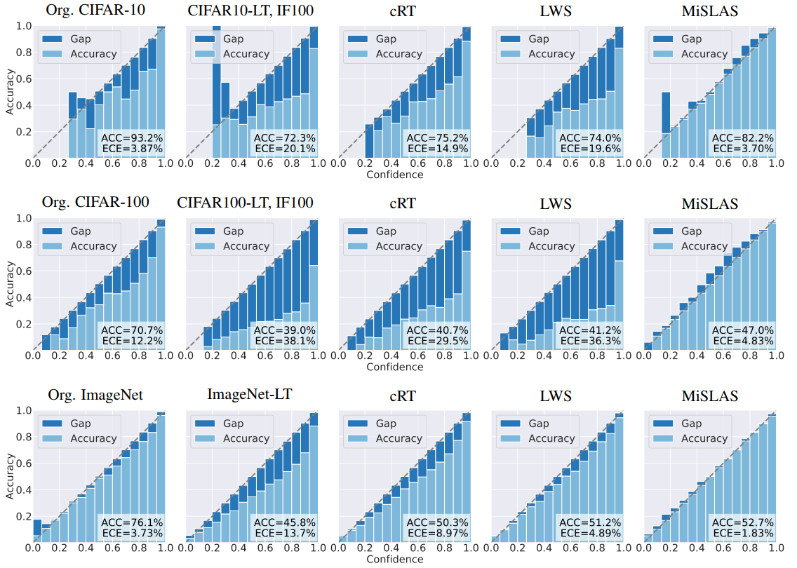

# MiSLAS
**Improving Calibration for Long-Tailed Recognition**

**Authors**: Zhisheng Zhong, Jiequan Cui, Shu Liu, Jiaya Jia

[[`arXiv`](https://arxiv.org/pdf/2104.00466.pdf)] [[`slide`]](./assets/MiSLAS.pdf) [[`BibTeX`](#Citation)]

<div align="center">
  
</div><br/>

**Introduction**: This repository provides an implementation for the CVPR 2021 paper: "[Improving Calibration for Long-Tailed Recognition](https://arxiv.org/pdf/2104.00466.pdf)" based on [LDAM-DRW](https://github.com/kaidic/LDAM-DRW) and [Decoupling models](https://github.com/facebookresearch/classifier-balancing). *Our study shows, because of the extreme imbalanced composition ratio of each class, networks trained on long-tailed datasets are more miscalibrated and over-confident*. MiSLAS is a simple, and efficient two-stage framework for long-tailed recognition, which greatly improves recognition accuracy and markedly relieves over-confidence simultaneously.

## Installation

**Requirements**

* Python 3.7
* torchvision 0.4.0
* Pytorch 1.2.0
* yacs 0.1.8

**Virtual Environment**
```
conda create -n MiSLAS python==3.7
source activate MiSLAS
```

**Install MiSLAS**
```
git clone https://github.com/Jia-Research-Lab/MiSLAS.git
cd MiSLAS
pip install -r requirements.txt
```

**Dataset Preparation**
* [CIFAR-10 & CIFAR-100](https://www.cs.toronto.edu/~kriz/cifar.html)
* [ImageNet](http://image-net.org/index)
* [iNaturalist 2018](https://github.com/visipedia/inat_comp/tree/master/2018)
* [Places](http://places2.csail.mit.edu/download.html)

Change the `data_path` in `config/*/*.yaml` accordingly.

## Training

**Stage-1**:

To train a model for Stage-1 with *mixup*, run:

(one GPU for CIFAR-10-LT & CIFAR-100-LT, four GPUs for ImageNet-LT, iNaturalist 2018, and Places-LT)

```
python train_stage1.py --cfg ./config/DATASETNAME/DATASETNAME_ARCH_stage1_mixup.yaml
```

`DATASETNAME` can be selected from `cifar10`,  `cifar100`, `imagenet`, `ina2018`, and `places`.

`ARCH` can be `resnet32` for `cifar10/100`, `resnet50/101/152` for `imagenet`, `resnet50` for `ina2018`, and `resnet152` for `places`, respectively.

**Stage-2**:

To train a model for Stage-2 with *one GPU* (all the above datasets), run:

```
python train_stage2.py --cfg ./config/DATASETNAME/DATASETNAME_ARCH_stage2_mislas.yaml resume /path/to/checkpoint/stage1
```

The saved folder (including logs and checkpoints) is organized as follows.
```
MiSLAS
├── saved
│   ├── modelname_date
│   │   ├── ckps
│   │   │   ├── current.pth.tar
│   │   │   └── model_best.pth.tar
│   │   └── logs
│   │       └── modelname.txt
│   ...   
```
## Evaluation

To evaluate a trained model, run:

```
python eval.py --cfg ./config/DATASETNAME/DATASETNAME_ARCH_stage1_mixup.yaml  resume /path/to/checkpoint/stage1
python eval.py --cfg ./config/DATASETNAME/DATASETNAME_ARCH_stage2_mislas.yaml resume /path/to/checkpoint/stage2
```

## Results and Models

**1) CIFAR-10-LT and CIFAR-100-LT**

* Stage-1 (*mixup*):

| Dataset              | Top-1 Accuracy | ECE (15 bins) | Model |
| -------------------- | -------------- | ------------- | ----- |
| CIFAR-10-LT   IF=10  | 87.6%          | 11.9%         | [link](https://drive.google.com/file/d/1dV1hchsIR5kTSqSOhdEs6nnXApcH5wEG/view?usp=sharing)  |
| CIFAR-10-LT   IF=50  | 78.1%          | 2.49%         | [link](https://drive.google.com/file/d/1LoczjQRK20u_HpFMLmzeT0pVCp3V-gyf/view?usp=sharing)  |
| CIFAR-10-LT   IF=100 | 72.8%          | 2.14%         | [link](https://drive.google.com/file/d/1TFetlV4MT4zjKEAPKcZuzmY2Dgtcqmsd/view?usp=sharing)  |
| CIFAR-100-LT IF=10   | 59.1%          | 5.24%         | [link](https://drive.google.com/file/d/1BmLjPReBoH6LJwl5x8_zSPnm1f6N_Cp0/view?usp=sharing)  |
| CIFAR-100-LT IF=50   | 45.4%          | 4.33%         | [link](https://drive.google.com/file/d/1l0LfZozJxWgzKp2IgM9mSpfwjTsIC-Mg/view?usp=sharing)  |
| CIFAR-100-LT IF=100  | 39.5%          | 8.82%         | [link](https://drive.google.com/file/d/15dHVdkI8J-oKkeQqyj6FtrHtIpO_TYfq/view?usp=sharing)  |

* Stage-2 (*MiSLAS*):

| Dataset              | Top-1 Accuracy | ECE (15 bins) | Model |
| -------------------- | -------------- | ------------- | ----- |
| CIFAR-10-LT   IF=10  | 90.0%          | 1.20%         | [link](https://drive.google.com/file/d/1iST8Tr2LQ8nIjTNT1CKiQ-1T-RKxAvqr/view?usp=sharing)  |
| CIFAR-10-LT   IF=50  | 85.7%          | 2.01%         | [link](https://drive.google.com/file/d/15bfA7uJsyM8eTwoptwp452kStk6FYT7v/view?usp=sharing)  |
| CIFAR-10-LT   IF=100 | 82.5%          | 3.66%         | [link](https://drive.google.com/file/d/1KOTkjTOhIP5UOhqvHGJzEqq4_kQGKSJY/view?usp=sharing)  |
| CIFAR-100-LT IF=10   | 63.2%          | 1.73%         | [link](https://drive.google.com/file/d/1N2ai-l1hsbXTp_25Hoh5BSoAmR1_0UVD/view?usp=sharing)  |
| CIFAR-100-LT IF=50   | 52.3%          | 2.47%         | [link](https://drive.google.com/file/d/1Z2nukCMTG0cMmGXzZip3zIwv2WB5cOiZ/view?usp=sharing)  |
| CIFAR-100-LT IF=100  | 47.0%          | 4.83%         | [link](https://drive.google.com/file/d/1bX3eM-hlxGvEGuHBcfNhuz6VNp32Y0IQ/view?usp=sharing)  |

*Note: To obtain better performance, we highly recommend changing the weight decay 2e-4 to 5e-4 on CIFAR-LT.*

**2) Large-scale Datasets**

* Stage-1 (*mixup*):

| Dataset     | Arch       | Top-1 Accuracy | ECE (15 bins) | Model |
| ----------- | ---------- | -------------- | ------------- | ----- |
| ImageNet-LT | ResNet-50  | 45.5%          | 7.98%         | [link](https://drive.google.com/file/d/1QKVnK7n75q465ppf7wkK4jzZvZJE_BPi/view?usp=sharing)  |
| iNa'2018    | ResNet-50  | 66.9%          | 5.37%         | [link](https://drive.google.com/file/d/1wvj-cITz8Ps1TksLHi_KoGsq9CecXcVt/view?usp=sharing)  |
| Places-LT   | ResNet-152 | 29.4%          | 16.7%         | [link](https://drive.google.com/file/d/1Tx-tY5Y8_-XuGn9ZdSxtAm0onOsKWhUH/view?usp=sharing)  |

* Stage-2 (*MiSLAS*):

| Dataset     | Arch       | Top-1 Accuracy | ECE (15 bins) | Model |
| ----------- | ---------- | -------------- | ------------- | ----- |
| ImageNet-LT | ResNet-50  | 52.7%          | 1.78%         | [link](https://drive.google.com/file/d/1ofJKlUJZQjjkoFU9MLI08UP2uBvywRgF/view?usp=sharing)  |
| iNa'2018    | ResNet-50  | 71.6%          | 7.67%         | [link](https://drive.google.com/file/d/1crOo3INxqkz8ZzKZt9pH4aYb3-ep4lo-/view?usp=sharing)  |
| Places-LT   | ResNet-152 | 40.4%          | 3.41%         | [link](https://drive.google.com/file/d/1DgL0aN3UadI3UoHU6TO7M6UD69QgvnbT/view?usp=sharing)  |

## <a name="Citation"></a>Citation

Please consider citing MiSLAS in your publications if it helps your research. :)

```bib
@inproceedings{zhong2021mislas,
    title={Improving Calibration for Long-Tailed Recognition},
    author={Zhisheng Zhong, Jiequan Cui, Shu Liu, and Jiaya Jia},
    booktitle={IEEE Conference on Computer Vision and Pattern Recognition (CVPR)},
    year={2021},
}
```

## Contact

If you have any questions about our work, feel free to contact us through email (Zhisheng Zhong: zszhong@pku.edu.cn) or Github issues.
